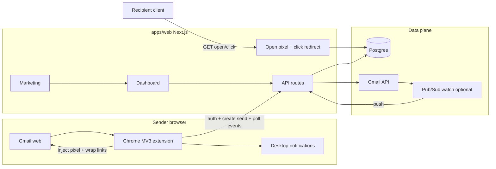
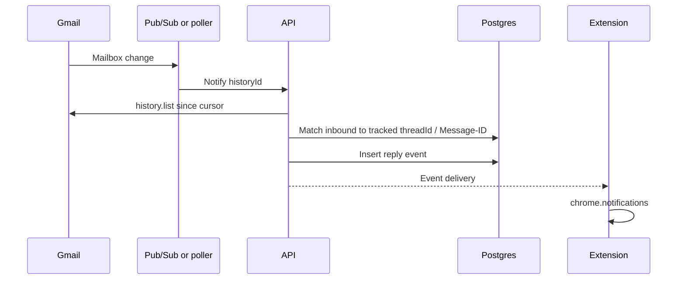

# feat: Engagement-first Gmail email tracking product

## Summary

Implement a greenfield **engagement-first** email tracking product: Chrome MV3 extension for Gmail web inject-on-send, tracking API (open pixel + link redirect), reply detection via Gmail API, desktop notifications, web dashboard, and public marketing site—all in a TypeScript monorepo with Next.js + Postgres.

## Problem Frame

Solo freelancers/consultants already use free Mailtrack-class tools but suffer noisy Gmail UI. Open pixels are increasingly unreliable (image blocking, Apple Mail Privacy Protection prefetches). The product bet is displacement: quieter Gmail chrome, notifications as the alert channel, and **clicks + replies** as primary signals (opens secondary). The repo is empty aside from GPL-3.0 `LICENSE` and the origin requirements doc—no stack or patterns to inherit.

## Requirements

Traceability to origin requirements (see origin: `docs/brainstorms/2026-07-18-engagement-first-gmail-tracking-requirements.md`).

**Tracking on send**

- R1. Chrome extension works on Gmail web compose/send (gmail.com / Workspace in browser).
- R2. Tracked sends inject open tracking.
- R3. Tracked sends wrap links for click attribution.
- R4. Replies to tracked sends are first-class engagement events.
- R5. UI and narrative lead with clicks and replies; opens are secondary/noisy.

**Send controls and Gmail surface**

- R6. Sticky last tracking on/off preference across composes.
- R7. Minimal compose control + quiet post-send tracked indicator (no dense Gmail chrome).
- R8. No forced branding footer required for tracking to work.

**Alerts and history**

- R9. Desktop notifications default on for meaningful engagement; user can disable.
- R10. Web dashboard: activity feed + basic settings.
- R11. Account identity so history/settings persist off-device.

**Commercial shell and honesty**

- R12. Public marketing site with signup/install path.
- R13. No locked pricing/billing required for v1.
- R14. Open events presented with noise humility (not ground truth).
- R15. Recipients never install software.

**Origin acceptance examples to honor:** AE1 sticky preference · AE2 engagement-first presentation · AE3 quiet Gmail vs notifications · AE4 reply as first-class · AE5 marketing path.

## Key Technical Decisions

- **KTD1. TypeScript monorepo (pnpm workspaces):** `apps/extension`, `apps/web`, `packages/shared`. One language and shared event/token types across extension, API, and dashboard. Greenfield freedom—no legacy stack.
- **KTD2. Next.js App Router for web + API:** Marketing pages, dashboard, auth callbacks, and tracking endpoints live in one deployable app (`apps/web`). Reduces ops surface for a solo-founder v1 vs splitting API and frontend early.
- **KTD3. Postgres as system of record:** Users, OAuth tokens (encrypted at rest), tracked sends, events, Gmail history cursors. Relational model fits “send has many events” and reply matching by `threadId` / `rfc822MessageId`.
- **KTD4. Chrome Manifest V3 + Gmail UI via InboxSDK (preferred) or thin compose adapter:** Content scripts on `mail.google.com`; service worker for auth, API calls, and `chrome.notifications`. Prefer InboxSDK for compose toolbar + body mutation to absorb Gmail DOM churn; fall back only if SDK constraints block minimal UI.
- **KTD5. Tracking tokens are opaque, unguessable, per-send (and per-link for clicks):** Open endpoint returns 1×1 GIF/PNG and records `open` events. Click endpoint records `click` then 302 to original URL. No PII in URLs beyond opaque IDs.
- **KTD6. Google OAuth for product auth + Gmail API for replies:** Sign-in with Google; request Gmail scopes needed for history/watch (minimum viable scope set; document for OAuth verification). Store refresh tokens server-side encrypted. Extension obtains session via extension-specific OAuth or token exchange after web login.
- **KTD7. Reply detection = Gmail push (`users.watch` + Pub/Sub) + `history.list`, with poll fallback:** On mailbox change, reconcile history; match new inbound messages to tracked sends by Gmail `threadId` and/or `In-Reply-To` / `References` vs stored Message-ID. Renew watch ≤7 days. If Pub/Sub setup blocks first milestone, ship **short-interval poll** of history as temporary path without changing the event model.
- **KTD8. Notifications default: clicks + replies only (not opens):** Aligns with engagement-first (R5/R9). Opens remain in history with humility copy. Opens may later become optional notify-on.
- **KTD9. Real-time path to extension:** Backend records event → extension learns via (a) authenticated polling of `/api/events/since` while SW alive, and/or (b) push (FCM/Web Push) if polling latency is insufficient. v1 accepts near-real-time polling (e.g. 15–60s) if push infra delays launch.
- **KTD10. English-first product copy;** no i18n framework required in v1.
- **KTD11. License posture:** Root `LICENSE` is GPL-3.0. Distributed extension and client JS are copyleft-sensitive. **Before public commercial distribution**, owners must relicense or accept full GPL compliance. Plan assumes implementation proceeds under current LICENSE until owners change it; do not invent dual-license terms in code without explicit owner decision.
- **KTD12. No forced tracking footer** in HTML body; optional legal disclosure page on marketing site only.

## High-Level Technical Design

### Component topology



### Tracked send sequence

```mermaid
sequenceDiagram
  participant U as Sender
  participant E as Extension
  participant A as API
  participant G as Gmail
  participant R as Recipient
  participant T as Track endpoints

  U->>E: Compose (sticky tracking on)
  E->>A: POST tracked-send (metadata, links)
  A-->>E: sendId, openUrl, link map
  E->>G: Inject pixel + rewrite links; send
  E->>A: Confirm sent (threadId, messageId)
  R->>T: GET open pixel
  T->>A: Record open event
  R->>T: GET click redirect
  T->>A: Record click event
  T-->>R: 302 original URL
  A-->>E: Event appears on poll / push
  E->>U: Desktop notification (click/reply)
```

### Reply detection (target)



### Domain model (directional)

- **User** — Google subject, email, notification prefs, encrypted refresh token, Gmail historyId cursor, watch expiration
- **TrackedSend** — owner userId, subject snippet, recipient hashes/emails as needed for display, Gmail threadId, rfc822 Message-ID, tracking enabled flag, createdAt, sticky snapshot
- **TrackedLink** — sendId, originalUrl, token
- **Event** — sendId, type (`open` | `click` | `reply`), occurredAt, linkId optional, raw metadata (user-agent for opens—used only for coarse noise signals, not identity resolution), dedupe key

### Event presentation rules

| Type  | History | Default notification | Copy posture        |
|-------|---------|----------------------|---------------------|
| click | Primary | Yes                  | “Clicked a link”    |
| reply | Primary | Yes                  | “Replied”           |
| open  | Secondary | No                 | “Possible open (noisy)” |

## Output Structure

```text
apps/
  extension/          # MV3 Chrome extension (WXT or Vite+CRX)
  web/                # Next.js: marketing, dashboard, API, track routes
packages/
  shared/             # Zod/types for events, API contracts, constants
docs/
  brainstorms/        # origin requirements (existing)
  plans/              # this plan
```

Implementer may adjust layout if tooling (e.g. WXT defaults) demands it; unit file lists remain authoritative.

## Phased Delivery

| Phase | Goal | Units |
|-------|------|-------|
| P0 Foundation | Repo, shared types, DB, auth | U1, U2 |
| P1 Tracking loop | Create send, pixel, clicks, inject on Gmail | U3, U4 |
| P2 Engagement alerts | Replies + notifications | U5, U6 |
| P3 Product shell | Dashboard + marketing | U7, U8 |

Demoable milestone after P1: tracked send → click event visible via API/dashboard stub. Full origin success criteria after P3.

---

## Implementation Units

### U1. Monorepo foundation and shared contracts

- **Goal:** Bootstrappable TypeScript monorepo with shared event/API types and Postgres connectivity so later units share one contract.
- **Requirements:** Enables R1–R15 structurally; no user-facing behavior alone.
- **Dependencies:** None
- **Files:**
  - `package.json`, `pnpm-workspace.yaml`, `turbo.json` (or equivalent)
  - `packages/shared/src/**` (event types, API DTOs, zod schemas)
  - `apps/web/package.json`, `apps/web/prisma/schema.prisma` (or Drizzle schema)
  - `apps/extension/package.json`, `apps/extension/manifest.config.*`
  - `README.md` (dev setup only—no product marketing)
  - `packages/shared/src/**/*.test.ts` (or colocated tests)
- **Approach:** pnpm workspaces; shared package exports `EventType`, create-send request/response, tracking token formats. Web app owns DB migrations. Extension and web depend on shared. Document required env vars without committing secrets.
- **Patterns to follow:** Conventional TS monorepo; strict TypeScript; no product UI yet.
- **Test scenarios:**
  - Shared schemas reject invalid event types and accept `open` | `click` | `reply`
  - Create-send DTO requires at least one recipient context field and optional link list
  - Token format helpers produce opaque non-sequential IDs (property: high entropy length)
- **Verification:** `pnpm install` works; shared package builds; empty web and extension packages typecheck.

### U2. Google auth, user accounts, and extension session

- **Goal:** Sender can sign in with Google, obtain a session for web and extension, and store Gmail-capable credentials server-side for later reply watch.
- **Requirements:** R11; enables R4, R9–R10, R12
- **Dependencies:** U1
- **Files:**
  - `apps/web/app/api/auth/**`
  - `apps/web/lib/auth/**`
  - `apps/web/lib/crypto/token-encryption.ts`
  - `apps/extension/src/background/auth.ts`
  - `apps/web/app/api/auth/**/*.test.ts` and/or `apps/web/lib/auth/**/*.test.ts`
- **Approach:** Google OAuth (authorization code). Scopes: OpenID profile email + Gmail readonly (or modify-free history scopes as required for `history.list`/`watch`—finalize exact scope strings during implementation against Google docs). Encrypt refresh tokens at rest with app secret. Extension: Chrome identity or loopback/token exchange so content scripts never hold refresh tokens. Session cookie for dashboard; short-lived access token for extension API.
- **Execution note:** Contract-test auth callback and token storage before wiring Gmail UI.
- **Test scenarios:**
  - Happy path: mock Google token exchange creates User and encrypted refresh token
  - Missing/invalid state parameter rejects callback
  - Extension token exchange with valid session returns API credential; invalid session 401
  - Refresh token ciphertext is not equal to plaintext; decrypt round-trips in unit test with test key
  - Sign-out revokes app session (extension subsequent calls 401)
- **Verification:** Locally complete Google OAuth (dev client), land on authenticated dashboard shell; extension background can call a protected `GET /api/me`.

### U3. Tracked-send creation, open pixel, and click redirect

- **Goal:** Backend can register a tracked send, serve open pixel events, and redirect tracked clicks with durable event rows.
- **Requirements:** R2, R3, R5, R14, R15
- **Dependencies:** U1, U2
- **Files:**
  - `apps/web/app/api/sends/**`
  - `apps/web/app/t/o/[token]/route.ts` (or `app/api/t/o/...`)
  - `apps/web/app/t/c/[token]/route.ts`
  - `apps/web/lib/tracking/**`
  - `apps/web/lib/tracking/**/*.test.ts`
  - `apps/web/app/t/**/*.test.ts`
- **Approach:** `POST /api/sends` (auth required) accepts subject, recipients display, list of hrefs → returns `sendId`, `openPixelUrl`, map originalUrl→trackUrl. On send confirm, extension patches Gmail IDs. Open endpoint: record event (dedupe soft: multiple opens allowed but rate-limit extreme bursts), return 1×1 image, cache-control no-store. Click endpoint: record click once-or-many (product: allow multiple clicks), 302 to original. Never put original PII in logs beyond what’s needed for abuse. Open events tagged for UI as noisy; no “unique opens” claim in API response fields used by primary UI.
- **Test scenarios:**
  - Create send returns pixel URL and rewritten link tokens for each http(s) link
  - Open GET records `open` event and returns image content-type
  - Click GET records `click` and redirects to original URL (preserve query string)
  - Unknown token → 404 without leaking existence of other tokens
  - Unauthenticated create send → 401
  - Covers AE2 data shape: events list can order click above open for same send
- **Verification:** curl/scripted create → open → click produces three durable events in DB for authenticated user ownership.

### U4. Gmail extension: sticky toggle, inject on send, quiet indicators

- **Goal:** On Gmail web, sender controls tracking with sticky preference; on send, extension applies pixel + link wrap; thread shows quiet tracked state.
- **Requirements:** R1, R2, R3, R6, R7, R8; origin flow F1
- **Dependencies:** U2, U3
- **Files:**
  - `apps/extension/src/contents/gmail.ts` (or InboxSDK bootstrap)
  - `apps/extension/src/background/**`
  - `apps/extension/src/ui/compose-toggle.*`
  - `apps/extension/src/lib/inject-tracking.ts`
  - `apps/extension/src/**/*.test.ts` (unit tests for inject pure functions)
- **Approach:** Content script on `https://mail.google.com/*`. Compose control: single minimal toggle (not a panel). Persist sticky preference in `chrome.storage.sync` (and mirror server preference when logged in). On send: if tracking on, call create-send, rewrite body links, append hidden pixel (img), then allow send; after send capture thread/message ids via InboxSDK or Gmail DOM/API and PATCH send. Post-send: small quiet badge/icon on conversation—no sidebar, no multi-widget chrome. No branding footer insertion.
- **Execution note:** Unit-test HTML rewrite pure functions extensively; manual Gmail smoke for DOM integration (fragile).
- **Test scenarios:**
  - Covers AE1: last preference off → new compose defaults off; toggle on → next compose on
  - Link rewriter rewrites http(s) anchors, skips `mailto:`, skips already-tracked URLs
  - Pixel injection adds single tracking image with correct token URL
  - Tracking off path: no API create-send, body unchanged
  - Missing auth: toggle explains sign-in; does not corrupt compose body
- **Verification:** Sideload extension; send tracked mail to self; pixel and click hit staging; Gmail UI remains minimal.

### U5. Reply detection via Gmail API

- **Goal:** When a recipient replies to a tracked thread, create a `reply` event and advance Gmail history cursor.
- **Requirements:** R4, R5; origin flow F2; AE4
- **Dependencies:** U2, U3
- **Files:**
  - `apps/web/lib/gmail/**`
  - `apps/web/app/api/gmail/watch/**`
  - `apps/web/app/api/internal/gmail-push/**` (Pub/Sub push handler)
  - `apps/web/lib/gmail/reply-matcher.ts`
  - `apps/web/lib/gmail/**/*.test.ts`
- **Approach:** After auth, start/renew `users.watch` when Pub/Sub is configured; else cron/worker polls `history.list`. For each new message, if inbound and matches a `TrackedSend.threadId` (or Message-ID headers), insert `reply` event once per reply message id (idempotent). Ignore sender’s own messages. Document Google Cloud setup for Pub/Sub in README ops section. Scope verification path is a launch risk—note in Risks.
- **Test scenarios:**
  - Covers AE4: history payload with inbound reply in tracked thread → one `reply` event
  - Own sent message in thread does not create reply
  - Duplicate history delivery is idempotent (same gmail message id)
  - Unmatched thread creates no event
  - Watch renewal updates expiration cursor fields
- **Verification:** Reply to a tracked self-send in Gmail; reply event appears in DB within poll/push SLA.

### U6. Desktop notifications for clicks and replies

- **Goal:** Extension shows desktop notifications by default for click and reply events; user can disable; opens do not notify by default.
- **Requirements:** R9, R5; origin flow F2; AE3
- **Dependencies:** U3, U4, U5 (U5 for reply path; clicks work after U3+U4)
- **Files:**
  - `apps/extension/src/background/notifications.ts`
  - `apps/extension/src/background/event-poller.ts`
  - `apps/web/app/api/events/**`
  - `apps/web/app/api/events/**/*.test.ts`
  - `apps/extension/src/background/**/*.test.ts`
- **Approach:** `GET /api/events/since?cursor=` returns new events for user. Service worker alarms poll while extension installed. On click/reply event, `chrome.notifications.create` with concise copy. Respect user setting `notificationsEnabled` (default true) and per-type defaults (open: false). Do not inject Gmail DOM chrome for the alert itself.
- **Test scenarios:**
  - Covers AE3: click event + notifications on → notification payload created; no Gmail DOM mutation API called
  - notificationsEnabled false → no notification
  - open event → no notification by default
  - reply event → notification
  - Poll cursor advances; no re-notify for same event id
- **Verification:** Click tracked link; desktop notification appears within poll interval; disable setting stops further notifications.

### U7. Dashboard activity feed and settings

- **Goal:** Authenticated web dashboard lists tracked sends with engagement-first ordering and basic settings.
- **Requirements:** R5, R10, R11, R14; origin flow F3; AE2
- **Dependencies:** U2, U3, U5
- **Files:**
  - `apps/web/app/(dashboard)/**`
  - `apps/web/components/activity/**`
  - `apps/web/app/api/settings/**`
  - `apps/web/components/activity/**/*.test.tsx` and/or Playwright `apps/web/e2e/dashboard.spec.ts`
- **Approach:** Activity feed: each send shows primary badges for click/reply counts; opens labeled secondary/noisy. Detail view lists events newest-first with type emphasis. Settings: notifications toggle, sign out. No billing UI. Empty states coach engagement-first (“Track a send from Gmail”).
- **Test scenarios:**
  - Covers AE2: send with 3 opens + 1 click emphasizes click in list/detail
  - Unauthenticated dashboard routes redirect to login
  - Settings toggle persists and is read by `/api/me` or settings GET
  - Feed only shows current user’s sends
- **Verification:** After tracked send + click + reply, dashboard shows correct hierarchy without open-rate hero metrics.

### U8. Marketing site and install/signup path

- **Goal:** Public marketing site explains engagement-first value and leads visitor through signup → extension install → first tracked send guidance.
- **Requirements:** R12, R13; origin flow F4; AE5
- **Dependencies:** U2, U4, U7
- **Files:**
  - `apps/web/app/(marketing)/**`
  - `apps/web/app/privacy/page.tsx` (minimal privacy notice—tracking disclosure)
  - `apps/web/e2e/marketing-funnel.spec.ts` (optional smoke)
- **Approach:** Landing: hero for freelancers/consultants, quiet Gmail + clicks/replies story, CTA “Continue with Google” + “Install Chrome extension” (Web Store URL or sideload instructions for pre-store). No pricing page required. Post-auth onboarding checklist: install extension → open Gmail → send test. Privacy page discloses open/click/reply collection at high level (legal polish deferred).
- **Test scenarios:**
  - Covers AE5: marketing CTA reaches auth; post-auth sees install instructions
  - Landing asserts no “#1 open rate tracker” style hero (copy test or snapshot of key strings)
  - Privacy page reachable from footer
- **Verification:** Cold visitor path documented in README; screenshot/demo script from landing → tracked send → notification.

---

## Scope Boundaries

### Deferred for later (from origin)

- Outlook web and other mail clients
- Team / shared inbox, multi-seat admin, CRM sync, sequences
- Smart rules (recipient/domain/label)
- Digests and advanced notification routing
- Pricing, billing, free-tier limits
- Mobile mail / non-Chrome first-class
- Deep analytics (funnels, A/B, heatmaps)

### Outside this product's identity (from origin)

- Full ESP / bulk marketing platform
- Surveillance-grade recipient identity resolution
- Sales engagement suite (Outreach/Salesloft class)
- Winning primarily via free forever + aggressive branding

### Deferred to Follow-Up Work (plan-local)

- Chrome Web Store listing assets, review compliance package, and production OAuth verification video
- Advanced open-noise heuristics (UA clustering, MPP proxy fingerprinting) beyond honest labeling
- Web Push/FCM if polling is insufficient at scale
- Multi-environment infra-as-code beyond a single staging deploy
- Contributor CLA / formal relicense process documentation after owner decision

## Alternative Approaches Considered

| Approach | Why not chosen for v1 |
|----------|----------------------|
| Extension-only, no backend | Cannot meet R10/R11 multi-session history, reliable reply detection, or commercial shell |
| Separate API service + separate marketing repo | Extra deploy/ops cost before product-market proof; can split later from Next.js monorepo |
| DOM-only reply detection in Gmail tab | Fails when Chrome closed; weaker than Gmail API history |
| Opens as primary metric + notify-on-open default | Conflicts with origin engagement-first decision and MPP reality |
| Build Gmail UI purely on raw DOM without InboxSDK | Higher breakage risk; only fall back if SDK blocks minimal UI |

## Risk Analysis & Mitigation

| Risk | Impact | Mitigation |
|------|--------|------------|
| Gmail DOM / InboxSDK breakage | Inject fails silently | Isolate pure inject logic; monitoring for zero create-send; pin SDK version; manual smoke checklist |
| Open signal noise (MPP, proxies) | User distrust | R14 UX; notify only click/reply; copy “possible open” |
| Gmail OAuth restricted scopes / verification | Reply detection blocked for unverified app | Ship poll with test users; start verification early; document test-user allowlist |
| GPL-3.0 vs closed commercial distribution | Legal/product conflict | Owner decision before public Web Store; see KTD11 |
| Extension policy / remote code | Store rejection | No eval remote scripts; MV3 compliant; package InboxSDK correctly |
| Click redirect abuse / open redirect | Security | Allow only http(s); optional allowlist; tokens bound to original URL server-side |
| Token guessing | False events | Cryptographically long opaque tokens; rate limit endpoints |

## System-Wide Impact

- **Auth boundary:** Refresh tokens only on server; extension uses short-lived credentials. Compromise of extension storage must not yield long-lived Google refresh tokens.
- **Privacy:** Recipients interact only with tracking endpoints; no recipient accounts. Collect minimal event metadata (timestamp, event type, optional coarse UA for open-noise labeling—not for recipient profiling).
- **Failure propagation:**
  - Tracking API down at send time → extension should fail closed (send untracked or block with clear error—prefer **send untracked with toast** over delaying user mail indefinitely; log for dashboard).
  - Gmail history lag/outage → delayed reply events only; click/open paths independent.
  - Poller stalled → missed notifications until resume; events still durable in DB for dashboard.
- **Performance:** Open/click endpoints must be fast and cache-hostile (`Cache-Control: no-store`); avoid auth middleware on public track routes.
- **Data lifecycle:** Soft retention target 90–180 days for events (confirm at privacy copy time); deleting a user must cascade sends/events/tokens.
- **Ops:** Gmail watch renewal job (≤7 day expiry); DB backups; encrypted secrets in host platform; staging vs prod Google OAuth clients.

## Dependencies / Prerequisites

- Google Cloud project: OAuth client, Gmail API enabled; Pub/Sub topic + domain verification for push (optional initially)
- Postgres instance (local Docker + hosted staging)
- Chrome for development sideload
- Owner decision timeline on LICENSE for public launch (does not block private development)

## Open Questions

### Resolved in this plan

- Reply mechanism → Gmail API history + watch/poll (KTD7)
- Auth → Google OAuth + encrypted server refresh tokens (KTD6)
- Default notifications → clicks + replies only (KTD8)
- Stack → TS monorepo, Next.js, Postgres, MV3 (KTD1–4)
- Locale → English-first (KTD10)

### Deferred to implementation

- Exact Gmail OAuth scope strings and whether `gmail.readonly` suffices for all history operations
- InboxSDK app registration vs pure adapter after spike
- Poll interval vs Web Push priority once latency measured
- Hosting vendor (Vercel/Fly/Railway/etc.) and custom tracking domain
- Event retention window (suggest 90–180 days default; confirm at privacy page time)
- Precise product name / branding strings

### Owner decision (non-blocking for private dev)

- Relicense vs remain GPL-3.0 for distributed clients before Chrome Web Store public listing

## Success Metrics

- End-to-end demo: marketing → Google auth → extension install → tracked Gmail send → click notification + dashboard click emphasis (origin success criteria)
- Reply path demo within same session or ≤ poll SLA
- Manual UX review: Gmail remains minimal vs a Mailtrack-like dense UI (qualitative)

## Documentation Plan

- Root `README.md`: monorepo setup, env vars, sideload extension, Gmail API setup
- Short `docs/ops-gmail-watch.md` when Pub/Sub path lands
- Privacy page content minimal in U8; full legal review out of band

## Sources & Research

- Origin: `docs/brainstorms/2026-07-18-engagement-first-gmail-tracking-requirements.md`
- Repo research: greenfield confirmed; only `LICENSE` (GPL-3.0) + requirements doc
- Gmail API push: `users.watch` + Pub/Sub + `history.list` (Google Workspace Gmail API guides)
- Open tracking noise: Apple Mail Privacy Protection prefetches images → inflated opens (industry consensus; informs KTD8 and R14 UX)
- Gmail extension UI: InboxSDK Compose APIs for stable compose hooks vs raw DOM
- No institutional `docs/solutions/` learnings exist yet

## Assumptions

- Solo implementer or small team; single-tenant SaaS is fine for v1 (no multi-workspace).
- Staging Google OAuth test users suffice until verification.
- Freelancer beachhead does not require multi-inbox account switcher in v1 (primary Google account only).
