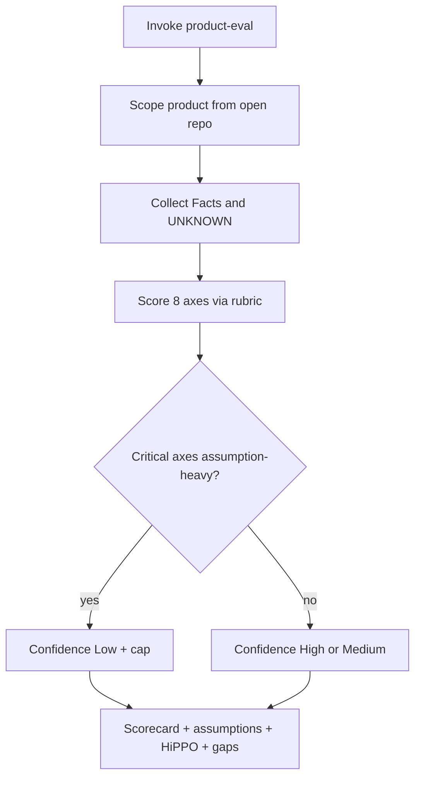

# feat: Product-eval evidence-first audit skill

## Summary

Create a portable Grok skill `product-eval` that audits the product in the open workspace using an evidence-first Gatekeeper workflow and Hiếu Nguyễn–aligned eight-axis rubric. Default install is user-level (`~/.grok/skills/product-eval/`) so the skill works across repos. Deliverables are `SKILL.md` (agent workflow) plus `references/rubric.md` (score anchors, confidence cap, output shape). No application code changes in mail-tracking.

---

## Problem Frame

Operators need a repeatable way to score an existing product without sliding into HiPPO / gut-feel justification. The origin requirements pin audit-of-open-repo, eight mandatory axes, facts-before-scores, assumptions log, confidence caps on weak critical axes, and a chat scorecard with prioritized gaps — not a workshop facilitator or auto-written history. Packaging must follow Grok skill conventions so `/product-eval` is invocable and auto-triggerable via description keywords. (see origin: `docs/brainstorms/2026-07-24-product-eval-skill-requirements.md`)

---

## Requirements Trace

| Origin | Plan treatment |
|--------|----------------|
| R1–R3 Packaging & invocation | U1 frontmatter + directory |
| R4–R6 Input & subject | U1 workflow Phase 0–1 |
| R7–R11 Evidence-first + confidence cap | U1 + U2 |
| R12–R14 Rubric axes | U2 |
| R15–R16 Anti-HiPPO | U1 output rules + U2 flags |
| R17–R20 Output shape & language | U1 + U2 template |
| R21–R22 Non-behavior | U1 scope guards |
| AE1–AE6 Acceptance examples | U3 smoke checklist maps to these |
| F1–F4 Key flows | U1 ordered phases |

---

## Key Technical Decisions

- **Install target: user-level** `~/.grok/skills/product-eval/`. Portable across products; project-level install is optional later, not v1. (see origin Key Decisions)
- **Split skill body vs rubric.** `SKILL.md` holds invocation, phased workflow, output order, and hard rules. `references/rubric.md` holds 1–5 anchors per axis, critical-axis list, confidence-cap formula, and HiPPO flag criteria. Keeps the agent prompt lean while scores stay stable.
- **Score scale: integer 1–5** plus **N/A** only for Org fit when no org signal exists. Anchors are outcome-oriented (what evidence looks like at each level), not vanity labels.
- **Critical axes for confidence cap:** User understanding, Needs & under-served pain, Utility × viability. If **two or more** of these are scored primarily on assumptions/UNKNOWN (or score ≤2 with no Fact sources), overall confidence band is **Low** and must not be reported as High/Strong.
- **Overall confidence bands:** High / Medium / Low only — derived from critical-axis evidence quality, not average of all eight scores.
- **HiPPO flag rule:** Emit when repo/docs assert priority or success without linked market/user/viability evidence, or when recommendations would require inventing user need.
- **Language:** Instruction language English; operator-facing sections follow operator language when clearly VN or EN.
- **No scripts, no app hooks.** Pure prompt skill; agent uses normal repo read tools.
- **Verification:** Structural smoke + manual dry-run checklist against origin AEs — no automated unit tests for prompt packages.

---

## High-Level Technical Design



Workflow is sequential and non-optional: evidence before scores; scores before gap prioritization.

---

## Output Structure

```text
~/.grok/skills/product-eval/
  SKILL.md
  references/
    rubric.md
```

Plan artifact lives in this repo under `docs/plans/`; skill files are written outside the app tree by design.

---

## Scope Boundaries

**In scope**

- User-level `product-eval` skill with evidence-first Gatekeeper behavior
- Eight-axis rubric with anchors and confidence cap
- Chat-only default output

**Out of scope / deferred (from origin)**

- Auto-save eval history under `docs/product-evals/`
- Idea-gate mode for unbuilt products
- Full PM workshop facilitation
- Competitor-primary research mode
- Application feature work in mail-tracking

### Deferred to Follow-Up Work

- Optional project-scoped install under `.grok/skills/product-eval/`
- Opt-in “save report” flag
- Claude/Cursor dual-publish of the same skill if desired later

---

## Implementation Units

### U1. Skill package + workflow (`SKILL.md`)

- **Goal:** Installable Grok skill that runs the audit workflow end-to-end with hard evidence-first and non-behavior guards.
- **Requirements:** R1–R11, R15–R22; F1–F4; AE5, AE6
- **Dependencies:** None
- **Files:**
  - Create: `~/.grok/skills/product-eval/SKILL.md`
  - Create: `~/.grok/skills/product-eval/references/` (directory; rubric filled in U2)
- **Approach:**
  - Frontmatter: `name: product-eval`; `description` covering audit/scorecard/HiPPO/product evaluation/đánh giá product/`/product-eval`.
  - Body sections (actionable, ordered):
    1. **When to use / when not** — open-repo product audit; not idea workshop; not implement features.
    2. **Phase 0 — Scope** — identify product from workspace; optional focus; one clarifying question if empty (AE6).
    3. **Phase 1 — Evidence** — gather Facts with sources; mark UNKNOWN; no scores yet (R7–R9).
    4. **Phase 2 — Score** — load `references/rubric.md`; score all axes; N/A org when no signal.
    5. **Phase 3 — Gate** — assumptions log; confidence band; HiPPO flags (R10–R11, R15).
    6. **Phase 4 — Gaps** — 3–7 prioritized gaps; prefer evidence-gathering actions when weak (R16–R18).
    7. **Output template** — fixed section order matching origin R17.
    8. **Hard rules** — no silent file writes (R19); no inventing research; no app code changes as part of eval (R21).
  - Instruct agent to read `references/rubric.md` before scoring.
- **Patterns to follow:** Grok skill format from user-guide `08-skills.md` and `create-skill` (`name` + rich `description` + stepwise body). Prefer lean body like operational skills (`check-work`), not essay docs.
- **Test scenarios:**
  - Happy path: skill file has valid YAML frontmatter with `name: product-eval` and non-empty description including `/product-eval` and audit/eval trigger phrases.
  - Edge: description mentions Vietnamese trigger (đánh giá product) for bilingual operators.
  - Error/guard: body explicitly forbids scoring before evidence and forbids inventing product when context empty.
  - Integration: body references `references/rubric.md` so scoring cannot complete without U2 content.
- **Verification:** File exists at user skill path; frontmatter parses; phases 0–4 present; non-behavior and no-auto-write rules present.

### U2. Rubric anchors + confidence / HiPPO rules (`references/rubric.md`)

- **Goal:** Stable scoring definitions so repeated runs and different agents grade consistently.
- **Requirements:** R12–R16; R11; AE1–AE4
- **Dependencies:** U1 (directory + reference path)
- **Files:**
  - Create: `~/.grok/skills/product-eval/references/rubric.md`
- **Approach:**
  - Document scale 1–5 and N/A rules.
  - For each of 8 axes: purpose (1 line), what counts as Fact evidence, anchors for 1 / 3 / 5 (and brief 2/4 guidance if useful), “what would raise the score.”
  - **Critical axes** list and confidence-cap formula (KTD above).
  - HiPPO / gut-feel flag criteria with examples tied to AE4.
  - Org-fit N/A criteria (AE3).
  - Optional short output micro-template for one axis row (score | evidence | raise-score).
- **Patterns to follow:** Reference docs under compound-engineering skills (`references/` next to `SKILL.md`); keep tables scannable.
- **Test scenarios:**
  - Happy path: all 8 axes documented with 1/3/5 anchors.
  - Edge: Org fit documents N/A when no CODEOWNERS/team docs/ownership signals.
  - Covers AE1: User understanding axis forbids treating pure hypothesis as Fact.
  - Covers AE2: confidence cap formula matches KTD (two+ critical axes assumption-heavy → Low).
  - Covers AE4: HiPPO criteria include priority-without-evidence.
- **Verification:** Rubric complete; cap formula unambiguous; N/A and HiPPO sections present.

### U3. Smoke verification against origin acceptance examples

- **Goal:** Prove the skill package is complete and would satisfy AE1–AE6 if executed, without requiring a full product audit in planning.
- **Requirements:** Success criteria; AE1–AE6
- **Dependencies:** U1, U2
- **Files:**
  - Read-only verify: `~/.grok/skills/product-eval/SKILL.md`
  - Read-only verify: `~/.grok/skills/product-eval/references/rubric.md`
  - No product code changes
- **Approach:**
  - Checklist mapping each AE to a concrete presence check in skill text (or dry-run mental walkthrough).
  - Confirm skill appears under expected path; document slash usage `/product-eval` for operator.
  - Optional: run one dry audit on this mail-tracking repo as manual smoke only if implementer has time — not required for unit completion if checklist is fully green.
- **Test scenarios:**
  - Covers AE1–AE6: each acceptance example has a corresponding rule or phase in skill/rubric text.
  - Happy path: `name` + `description` + rubric path + output template all present.
  - Edge: confidence-cap and N/A org rules are copy-pasteable by the agent without invention.
- **Verification:** Checklist all green; operator told how to invoke; no accidental writes under `docs/product-evals/`.

---

## Risk Analysis & Mitigation

| Risk | Mitigation |
|------|------------|
| Agent soft-scores without evidence | Hard phase order + confidence cap + assumptions log required |
| Rubric too vague → inconsistent grades | Explicit 1/3/5 anchors and Fact criteria per axis |
| Skill only works in one repo | User-level install path |
| Operator expects file report | Explicit non-goal; chat default stated in skill body |
| Org axis invents team structure | N/A rule with examples |

---

## Open Questions

**Deferred to implementation**

- Exact wording of Vietnamese score labels if operator is VN (agent may free-form translate while keeping 1–5 scale).
- Whether a first real audit of mail-tracking is done in the same session as skill authoring (nice-to-have smoke only).

**None blocking.**

---

## Sources & Research

- Origin: `docs/brainstorms/2026-07-24-product-eval-skill-requirements.md`
- Grok skill format: user-guide skills docs; `create-skill` workflow
- Pattern examples: lean operational skills (`check-work`); multi-file skills with `references/` (compound-engineering skills)
- Methodological source: Hiếu Nguyễn notes carried in origin (market, persona/research, needs/under-served, UX/UI, feedback loop, utility × viability, data over top-down)

External best-practices web research was **not** load-bearing: skill packaging is fully specified by local Grok docs.
