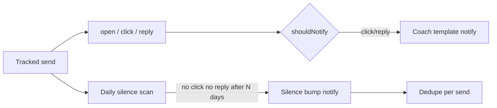

# feat: Link-first engagement + thin follow-up coach

## Summary

Finish V1 product shape from origin requirements: **prove no forced branding**, **upgrade click/reply notification copy to coach templates**, **add silence follow-up bump notify**, and **keep free full-core** (no billing). Marketing copy is largely done on `feat/universal-positioning-messaging`; this plan focuses on behavior gaps.

---

## Problem Frame

TrackPixl already tracks opens/clicks/replies and notifies on click/reply by default. Gaps vs origin: coach templates are generic (“Link clicked”); no silence bump; no automated regression that inject never adds a branding footer; silence/coach settings not explicit. (see origin: `docs/brainstorms/2026-07-24-followup-coach-link-first-requirements.md`)

---

## Requirements Trace

| Origin | Units |
|--------|--------|
| R1–R2 No branding | U1 |
| R3–R4 Link-first presentation | U2, U5 |
| R5–R8 Coach templates + silence | U2, U3, U4 |
| R9–R10 Free full core | All (no billing UI) |
| R11–R12 Positioning | U5 (audit only) |
| R13 Install path | Deferred note (CWS = follow-up work) |
| AE1–AE5 | U1–U5 tests/verification |

---

## Key Technical Decisions

- **No branding:** Treat as invariant + test on inject path (`prepare-body` / content script). No product footer feature exists today — add regression test so it cannot land later.
- **Coach templates live in shared + extension notify builder:** Single source of fixed strings for click/reply/silence; extension `buildNotification` consumes them. No LLM.
- **Silence default N = 5 calendar days** (planning default; product allows change later). Opens alone do **not** cancel silence; click or reply cancels.
- **Silence detection:** Prefer **extension chrome.alarms** daily scan of recent sends via existing API (list sends + events) to avoid new server worker infra in V1. If API lacks enough data, extend list endpoint minimally.
- **Silence notify default-on** when master notifications enabled; new pref `notifyOnSilence` default true.
- **CWS:** Out of this plan’s implementation units — tracked under Deferred Follow-Up.

---

## High-Level Technical Design

---

## Scope Boundaries

**In scope:** branding invariant, coach copy, silence bump + pref + dedupe, settings UI toggle, tests, copy audit.

**Out of scope:** AI drafts, proposal entity, billing, CWS listing, CRM.

### Deferred to Follow-Up Work

- Chrome Web Store packaging (R13 external success)
- Paid history tiers
- Per-link “they clicked X” deep coach
- Server-side silence job for multi-device consistency

---

## Implementation Units

### U1. No-branding invariant + regression test

- **Goal:** Guarantee free tracking never injects product branding footer.
- **Requirements:** R1, R2, AE1
- **Dependencies:** None
- **Files:**
  - Review: `apps/extension/src/lib/prepare-body.ts`, `apps/extension/src/content.ts`
  - Test: `apps/extension/src/lib/prepare-body.test.ts` (extend)
- **Approach:** Document invariant in test: prepared HTML must not contain “Sent with”, “TrackPixl”, or marketing footer patterns. Grep inject path for any footer append — remove if found.
- **Test scenarios:**
  - Happy: body with links prepared → no branding strings
  - Edge: empty body / plain text path if any
- **Verification:** Tests pass; manual send has clean body.

### U2. Coach templates for click + reply notifications

- **Goal:** Click/reply notifications use fixed coach-style templates (subject context), not bare labels only.
- **Requirements:** R5, R6, R3, AE3
- **Dependencies:** None
- **Files:**
  - `packages/shared/src/notifications.ts` (or new `coach-templates.ts` + export)
  - `packages/shared/src/notifications.test.ts`
  - `apps/extension/src/lib/notify.ts` + `notify.test.ts`
- **Approach:** Export template builders: `coachClick(subject)`, `coachReply(subject)`. Titles/messages in plain language (“They engaged a link on: …”, “They replied to: …”). Keep `shouldNotifyForEvent` behavior (open default off).
- **Test scenarios:**
  - Happy: click/reply with subject → expected title/message substrings
  - Edge: empty subject → fallback phrase
  - Prefs off → null / no notify
- **Verification:** Unit tests green; manual click produces coach wording.

### U3. Silence bump: prefs + shared logic + extension alarm

- **Goal:** After N days without click or reply, one silence-template notification per send.
- **Requirements:** R7, R8, R8b, AE4
- **Dependencies:** U2 (template style)
- **Files:**
  - `packages/shared` — silence eligibility pure function + tests
  - `apps/web` — settings schema/API for `notifyOnSilence` if persisted on User
  - `apps/web/prisma/schema.prisma` — optional `notifyOnSilence Boolean @default(true)`
  - `apps/extension/src/background.ts` — alarm + scan + dedupe storage
  - `apps/extension/src/lib/notify.ts` — silence template
- **Approach:**
  - Pure fn: given send createdAt, event types, now, N → boolean eligible.
  - Dedupe: `chrome.storage` set of sendIds already silence-notified.
  - Alarm: once daily; fetch recent sends (e.g. last 30d) via API; evaluate; notify once.
  - Default N=5; constant in shared for V1.
- **Test scenarios:**
  - Eligible: 6 days old, only opens → true
  - Not eligible: has click or reply → false
  - Not eligible: already notified → false (storage)
  - Prefs: notifyOnSilence false → no notify
- **Verification:** Unit tests for pure logic; manual or simulated alarm path documented.

### U4. Settings UI for silence coach

- **Goal:** Sender can disable silence bumps without killing click/reply notify.
- **Requirements:** R8b
- **Dependencies:** U3
- **Files:**
  - `apps/web/src/app/dashboard/settings-form.tsx`
  - Settings API route / Zod schemas in shared
- **Approach:** Checkbox “Suggest follow-up when quiet” bound to `notifyOnSilence`; persist via existing settings PATCH.
- **Test scenarios:** Toggle persists; extension receives pref on sync.
- **Verification:** UI round-trip works.

### U5. Positioning / Activity copy audit

- **Goal:** Dashboard empty states and any remaining open-hero copy match R3–R4, R11.
- **Requirements:** R3, R4, R11, R12, AE5
- **Dependencies:** None
- **Files:**
  - `apps/web/src/app/dashboard/*` (empty/waiting copy)
  - Spot-check homepage already updated
- **Approach:** Grep for open-rate-first language; align “Waiting for engagement” with click/reply.
- **Test expectation:** none — copy only
- **Verification:** Manual UI read-through.

---

## Risk Analysis

| Risk | Mitigation |
|------|------------|
| Silence spam | One notify per send; N=5; pref off |
| Multi-device silence double-fire | Accept V1 extension-local dedupe; server job later |
| API missing events for silence calc | Extend list payload if needed in U3 |
| GPL vs CWS | Deferred; not blocking coach |

---

## Open Questions (implementation)

- Exact template EN strings (product polish in U2/U3)
- Whether silence considers “possible open” at all (plan: **no**)

---

## Sources

- Origin requirements: `docs/brainstorms/2026-07-24-followup-coach-link-first-requirements.md`
- Ideation: `docs/ideation/2026-07-24-better-than-email-tracker-ideas.md`
- Existing: `packages/shared/src/notifications.ts`, extension notify + background prefs sync
